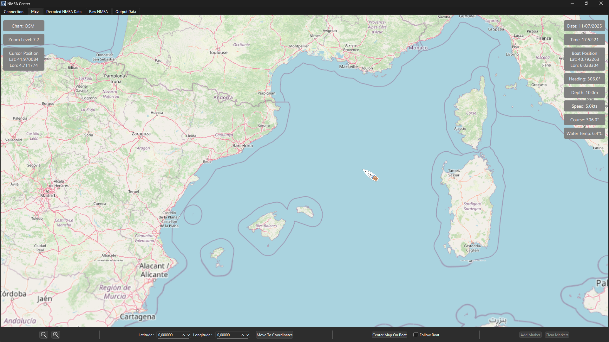

# NMEA Center — Monitoring & Forwarding Tool for NMEA0183

**NMEA Device Connection**  
Connect any NMEA0183 compatible device via serial or UDP.

**NMEA Monitoring**  
Display both raw and decoded NMEA sentences (GGA, RMC, GSV, etc.) in real-time.

**Map Display**  
Integrated OpenStreetMap panel showing the real-time boat position and NMEA-derived data (e.g., speed, heading, etc).

**Data Forwarding**  
Forward received NMEA data to UDP and/or secondary serial ports
     
**Selective Output Control**  
Filter sentence types (e.g. output only GGA or RMC) on each output.

**Data Logging**  
Record data to a local file in multiple formats (txt, csv, nmea, log)

